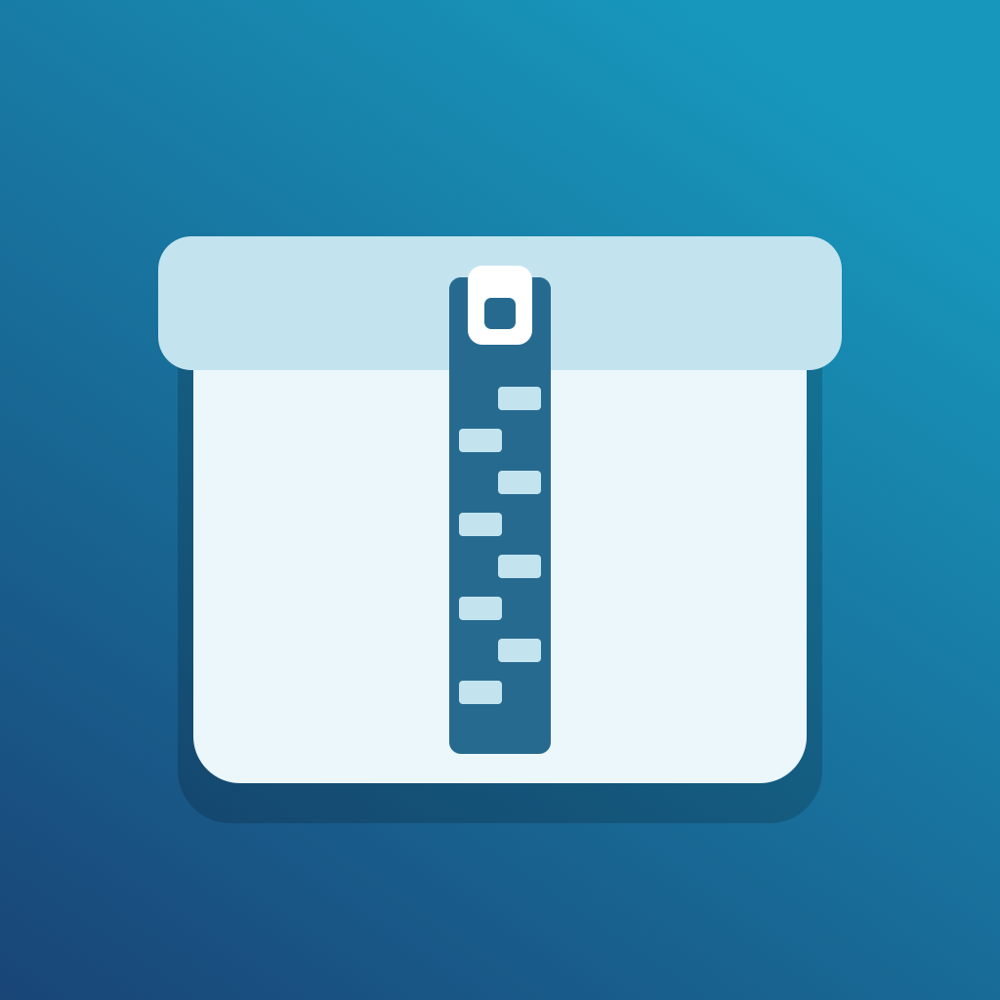

# ArchiveDesk for iOS

ArchiveDesk 是面向 iPhone、iPad 和 iPhone Duo 自适应界面的压缩包浏览与安全解压工具。采用 SwiftUI 和进程内原生解码引擎，不依赖桌面版 7-Zip 命令行程序。

当前版本：**0.1.0 / 开发测试版**。最低系统：**iOS / iPadOS 26.0**。Duo 的新布局使用 iOS 27.1+ API，旧系统保留兼容布局。



## 下载与安装

在 [Releases](https://github.com/HachiMiku39/archivedesk_ios/releases) 下载 `ArchiveDesk-0.1.0-unsigned.ipa`。

**这是未签名的 arm64 真机 IPA，不是模拟器包，不能直接安装。** 安装前必须使用自己的有效 Apple 签名证书及描述文件重新签名。也可以在 Xcode 中选择自己的 Team、调整 Bundle Identifier 后运行到设备。此发布不是 App Store / TestFlight 发行版，不承诺第三方重签工具的兼容性。

本版真机 Release 使用 Xcode 27.1 beta / iOS 27.1 SDK 构建，最低系统仍为 26.0；Duo 与其他模拟器验证分别使用 27.1 / 27.2 beta 环境。真机签名安装与外置设备验证尚未完成。

## 已实现的功能

- 通过系统“文件”选择压缩包；支持本地、iCloud、外置存储及其他文件提供商的读取。
- 文件夹层级浏览、搜索、文件选择和条目详情。
- 预览不超过 256 KiB 的 UTF-8 文本：TXT、Markdown、JSON、XML、CSV、日志、Swift、PLIST、YAML 等。
- 解压全部或选中文件，保留相对目录结构。
- 支持中文、日文及 UTF-8 文件名；ZIP 未标记 UTF-8 的文件名采用 CP437 默认规则。
- iPhone / iPad 的紧凑和宽屏布局；Duo 折叠布局、内外屏切换和旋转时保留选中项及预览状态。
- 英文、简体中文、日文主界面；部分引擎错误和开发诊断仍为英文。
- 应用内展示第三方组件许可；公开版本使用原创中性压缩箱图标。

## 格式支持

“支持”指已集成对应读取引擎并有样本验证，并不意味着该扩展名的所有编码或变体都受支持。

| 格式 | 当前能力 |
| --- | --- |
| ZIP / ZIP64 | 浏览、预览、解压；仅 Stored / Deflate（方法 0 / 8） |
| 7z | LZMA / LZMA2，含已验证的 solid 多文件样本 |
| RAR / RAR5 | 读取与解压；已验证压缩及 RAR5 solid 样本 |
| TAR | TAR、TAR.gz、TAR.bz2、TAR.xz |
| 单文件压缩流 | gzip、bzip2、XZ、LZMA-alone |
| ISO9660 | 浏览与文件解压；不是镜像挂载工具 |
| IPA / APK / JAR / EPUB | 按 ZIP 容器浏览；不提供安装、运行或专用包分析 |

引擎采用 **libarchive 3.8.9 + liblzma 5.8.4**，静态链接并使用系统 zlib、bzip2、iconv。未集成完整桌面 7-Zip。详见 [格式矩阵](docs/FORMAT-MATRIX.md) 和 [引擎说明](docs/ARCHIVE-ENGINES.md)。

**暂不支持：** 密码/加密压缩包、分卷流程、Zstd/LZ4、压缩包创建或编辑、RAR 修复、链接及特殊文件解压、任意格式的无限制兼容。大于 4 GiB 的 ZIP64 真机样本尚未验证。

## 存储读写规则

| 位置 | 读取压缩包 | 解压写入 |
| --- | --- | --- |
| ArchiveDesk 自身 Documents | 支持 | 支持 |
| 系统 iCloud Drive | 支持 | 通过系统目录选择器授权，并验证位置后写入 |
| 外置 USB / 存储卷 | 支持 | 经授权且确认是本地外置卷、可写时支持 |
| 其他网盘提供商 | 支持 | 不支持，保持只读 |
| 无法可靠识别的提供商、其他应用 Documents、SMB 等 | 可读取时支持 | 当前拒绝写入 |

读取使用 security-scoped 授权和 `NSFileCoordinator` 协调，将输入复制为应用私有快照，不修改原压缩包。解压目录通过系统目录选择器选择，不绕过 iOS 沙盒或文件提供商规则。

**并非所有“文件”App 显示的可写位置都已支持。** 无法可靠区分本地提供商和第三方云缓存时，应用采用只读策略。外置卷权限、拔盘异常、只读介质及真实 iCloud 同步仍需物理设备验证。详见 [存储访问说明](docs/STORAGE-ACCESS.md)。

## 安全与任务行为

- 校验路径穿越、绝对路径、链接、Unicode/大小写冲突及目录冲突。
- 解压到新建的独立目录，不合并或覆盖现有文件；失败或取消时清理本次临时目录。
- 按块流式写入，检查容量、声明大小和格式提供的完整性信息；ZIP 额外校验 CRC。
- TAR / ISO 没有天然文件校验和，不宣称所有格式都提供 CRC 校验。
- 原生编解码器单次分配上限 128 MiB、每线程在用分配上限 256 MiB；这不是整个应用的总内存上限。
- 任务支持取消，但 solid 压缩包的内部跳过可能延迟响应。
- 目前为前台任务；切换后台会取消工作，不支持持久化队列或跨启动断点续传。

## 构建

用具备对应 SDK 的 Xcode 打开 `ArchiveDeskIOS.xcodeproj`，选择 `ArchiveDeskIOS` scheme。Duo 调试使用 `ArchiveDeskIOS-DuoDebug`。

仓库附带 XCFramework 和校验过的上游源码压缩包。编译应用不需要安装桌面 7-Zip。未签名 Release 示例：

```sh
export DEVELOPER_DIR=/Applications/Xcode-27.1-beta.app/Contents/Developer
zsh scripts/build-ios.sh iphoneos Release
zsh scripts/package-unsigned-ipa.sh \
  "$PWD/work/Build-iphoneos-Release/Build/Products/Release-iphoneos/ArchiveDeskIOS.app"
```

若本地路径不同，调整 `DEVELOPER_DIR`。受限执行环境可能阻止 SwiftUI 宏插件或模拟器服务，请使用原生 Xcode 构建。签名分发请在 Xcode 选择自己的 Team，并按自己的描述文件与分发方式 Archive / Export。

重新构建原生依赖前，将已有 `Vendor/ArchiveCodecs.xcframework` 移到备份目录，再执行 `zsh scripts/build-codecs.sh`；脚本拒绝覆盖已有框架。可用 `xcrun swift scripts/render-app-icon.swift` 重建中性图标。

## 测试

```sh
zsh scripts/verify-core.sh
SEVENZIP=/absolute/path/to/7zz zsh scripts/make-format-fixtures.sh
python3 scripts/make-adversarial-fixtures.py
zsh scripts/verify-formats.sh
```

7zz 仅用于 Mac 开发端生成测试样本，不打包进 iOS 应用。UI 测试在 Xcode 中选择目标模拟器后运行。

2026-10-04 已完成：核心回归 55 项通过、2 项明确的桌面协调跳过；15 种普通格式样本及 CP437、恶意路径、损坏回滚、取消清理等检查；Duo 最终原生 UI 套件 7/7 通过；Release 模拟器构建通过，随后未签名真机 Release 构建通过。用户确认 Duo 外屏 0°、90°、270° 自动旋转正常。

这些结果不能替代物理设备、文件提供商、内存压力、后台期限和无障碍测试。详见 [Duo 调试记录](docs/DUO-DEBUG.md)。

## 组件与许可

第三方组件保留各自许可，完整文本见 [CodecNotices.txt](ArchiveDeskIOS/ThirdParty/CodecNotices.txt)，并随应用分发。原始源码包位于 `Vendor/Sources`。

当前仓库公开源码供查看与测试，**尚未为 ArchiveDesk 自有代码指定通用开源许可证**；公开可见不等于授予无限制再分发许可。第三方组件许可不受这一说明影响。

## English summary

ArchiveDesk is a SwiftUI archive browser and safe extractor for iOS/iPadOS 26+. It reads ZIP (Stored/Deflate), 7z LZMA/LZMA2, RAR/RAR5, TAR, gzip/bzip2/XZ/LZMA streams and ISO9660 through in-process codecs. It offers text preview, selected extraction, localized UI and adaptive iPhone Duo layouts. Verified iCloud/external destinations may be writable; third-party cloud providers remain read-only. The downloadable device IPA is **unsigned and requires re-signing**. Encryption, split volumes and archive creation are not supported.
